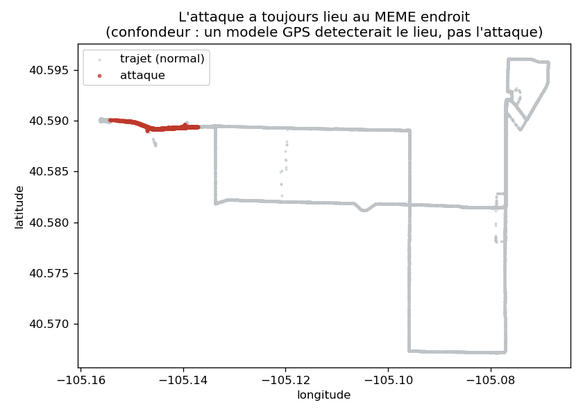
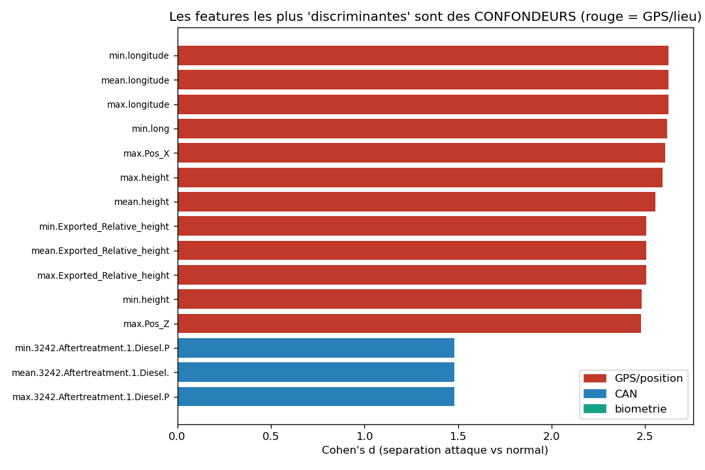
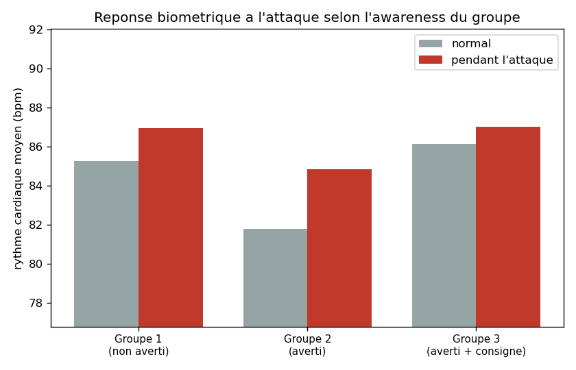

# P1 - Exploration des donnees (EDA) : resultats

> Code : [`notebooks/01_exploration.ipynb`](../../notebooks/01_exploration.ipynb) -
> Loader : [`src/data.py`](../../src/data.py) - Figures : `docs/assets/`

## Vue d'ensemble

| Metrique | Valeur |
|---|---|
| Fenetres de 1 s | **155 902** |
| Conducteurs | **50** (groupes : 17 / 16 / 17) |
| Cible `cyberattack_active` | **1,46 %** (2 273 fenetres) |
| Duree de l'attaque / conducteur | 23 a 75 s (mediane 42 s), a ~60 % du trajet |
| Signaux CAN exploitables | **337** |
| Biometrie | HR, EDA, IBI (7 colonnes) |
| Colonnes GPS / inertie (confondeurs) | **320** |
| Donnees manquantes | **28 %** en moyenne ; 141 colonnes > 50 % NaN |

L'attaque touche **les 50 conducteurs** et reste **rare** (1,46 %) : un cas de
detection desequilibree realiste.

## Constat n°1 (capital) : le confondeur LIEU

L'attaque survient **toujours au meme endroit**. Mesure de la concentration
geographique :

| | Ecart-type pendant l'attaque | Ecart-type sur tout le trajet | Rapport |
|---|---|---|---|
| longitude | 0,0034 | 0,0249 | **7x plus concentre** |
| latitude | 0,0002 | 0,0075 | **44x plus concentre** |

> Un modele utilisant le GPS apprendrait a alerter **a cet endroit precis** - du
> geofencing, pas de la detection d'intrusion. Les features de position sont donc
> **a exclure**.

## Constat n°2 : les confondeurs dominent le pouvoir discriminant

On classe toutes les features par leur separation attaque vs normal (Cohen's d) :

| Type de feature | Meilleur Cohen's d | Feature |
|---|---|---|
| **GPS / position** | **2,63** | longitude |
| CAN (J1939) | 1,48 | temperature d'echappement (filtre a particules) |
| Biometrie | 0,14 | rythme cardiaque (HR) |

> Deux lectures :
> - Les features de **lieu** ecrasent tout (d ~ 2,6).
> - Le « meilleur » signal **CAN** (d = 1,48) est une **temperature d'echappement**
>   - or celle-ci monte avec le **temps de roulage** (le moteur chauffe), et
>   l'attaque arrive a ~60 % du trajet : c'est encore le confondeur **temps**, pas
>   l'attaque. **Une fois lieu et temps retires, il ne reste quasiment aucune
>   signature CAN honnete.**

## Constat n°3 : une reponse biometrique a l'attaque

Le rythme cardiaque **monte pendant l'attaque**, de facon modulee par le groupe
d'awareness :

| Groupe | HR normal | HR attaque | Delta |
|---|---|---|---|
| 1 (non averti) | 85,3 | 87,0 | +1,7 |
| 2 (averti) | 81,8 | 84,9 | **+3,1** |
| 3 (averti + consigne) | 86,1 | 87,0 | +0,9 |

> Effet **reel mais modeste** (d global 0,14). Interpretation prudente : la hausse
> peut aussi venir du stress de conduite sur cette portion de route (encore un
> confondeur potentiel). A creuser, sans sur-interpreter.

## Constat n°4 : beaucoup de donnees manquantes

28 % de NaN en moyenne ; 141 colonnes a plus de 50 % de NaN (signaux rarement
emis). Le pretraitement devra **selectionner les signaux assez remplis** et
**imputer** le reste.

## Consequences pour la suite

| Decouverte | Impact sur le plan |
|---|---|
| Confondeur lieu (GPS) | **Exclure les 320 colonnes VBOX** des features |
| Confondeur temps (derive) | Se mefier des signaux a derive lente ; controler le temps |
| 50 conducteurs | **Split PAR CONDUCTEUR** (anti-fuite), validation croisee groupee |
| Attaque rare (1,46 %) | Metriques **PR-AUC / precision-recall**, pas l'accuracy |
| 28 % NaN | Selection des signaux remplis + imputation |
| Pas de signature CAN evidente | **Question ouverte et honnete** : l'attaque est-elle detectable proprement ? |

-> Etape suivante : **P2/P3 - Pretraitement, selection de features hors
confondeurs, et strategie de split par conducteur.**
