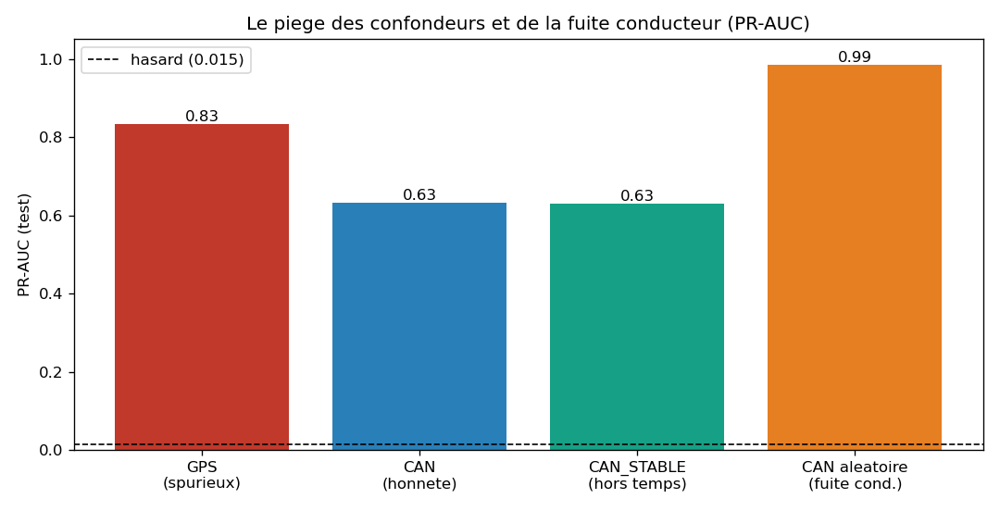

# P2/P3 - Pretraitement honnete et split par conducteur

> Code : [`src/features.py`](../../src/features.py) -
> [`notebooks/02_preprocessing.py`](../../notebooks/02_preprocessing.py)

## Objectif

Construire le terrain de jeu **sans tricher** : exclure les confondeurs, gerer
les NaN, et mettre en place une validation **par conducteur**. C'est l'etape qui
decide de l'honnetete de tout le reste.

## 1. Gestion des confondeurs

### Confondeur de LIEU (GPS) - exclu
Les ~312 colonnes GPS / inertie sont **retirees** des features : elles
encoderaient l'endroit de l'attaque (cf. [eda_findings](eda_findings.md)).

### Confondeur de TEMPS - repere et teste
Certains signaux CAN derivent avec le temps de roulage (le moteur chauffe), donc
correlent avec l'instant de l'attaque (~60 % du trajet). On mesure, pour chaque
signal, sa correlation avec la progression du trajet :

- Correlation maximale observee : **0,43** (capteurs d'apres-traitement / gaz
  d'echappement) - moderee, **aucun signal n'est domine par le temps**.
- On flague les 21 signaux a |corr| > 0,35 pour former un jeu **CAN_STABLE**
  (sans eux) et tester leur influence.

## 2. Jeux de features

| Jeu | Taille | Role |
|---|---|---|
| **CAN** | 337 | signaux J1939 (honnetes) - base de travail |
| CAN_STABLE | 316 | CAN sans les 21 signaux a derive temporelle |
| BIO | 7 | biometrie (HR, EDA, IBI) |
| GPS | 312 | **exclu** (confondeur lieu) - garde seulement pour l'ablation |

> NaN (28 %) : le Gradient Boosting (HistGB) les gere nativement ; pour les
> modeles a distance/gradient, on imputera (mediane) **dans le pipeline** (ajuste
> sur le train, anti-fuite).

## 3. Le split PAR CONDUCTEUR

| Verification | Resultat |
|---|---|
| Conducteurs train / test | 38 / 12 |
| **Chevauchement de conducteurs** | **0** (anti-fuite) |
| Taux d'attaque train / test | 1,47 % / 1,43 % (preserve) |

> On utilisera une **validation croisee groupee** (GroupKFold / leave-one-driver-
> out) en P5 : un conducteur n'est jamais a la fois en train et en test.

## 4. Demonstrations chiffrees (PR-AUC, Gradient Boosting)

Rappel : un modele aleatoire a une PR-AUC ~ 0,015 (le taux d'attaque).

| Scenario | PR-AUC | Lecture |
|---|---|---|
| **GPS**, split conducteur | **0,834** | SPURIEUX : detecte le lieu (geofencing), pas l'attaque |
| **CAN** (honnete), split conducteur | **0,632** | la vraie difficulte - un signal genuine existe |
| CAN_STABLE (hors temps), split conducteur | 0,630 | identique -> le signal NE vient PAS du confondeur temps |
| **CAN, split ALEATOIRE** | **0,985** | TROMPEUR : fuite par le conducteur |

## 5. Trois enseignements

1. **Le GPS est un piege** : 0,834 de PR-AUC sans rien comprendre a l'attaque -
   juste son lieu. A exclure absolument.
2. **La fuite par le conducteur est massive** : un split aleatoire donne 0,985,
   contre 0,632 par conducteur. Le split aleatoire **flatte** de +0,35. C'est
   l'equivalent (en pire) de notre lecon sur le split temporel.
3. **Mais l'attaque EST genuinement detectable** (0,632 >> 0,015), et ce signal
   ne tient ni au GPS ni au confondeur temps (CAN_STABLE = 0,630). **0,632 est
   donc notre point de depart honnete** pour la modelisation.

> A retenir : sans cette discipline (exclure le GPS, splitter par conducteur), on
> aurait « prouve » un detecteur a 0,98 - entierement spurieux. La rigueur du
> pretraitement est ce qui separe un resultat credible d'un artefact.

-> Etape suivante : **P4 - Modelisation multi-chemins** sur les features CAN
(honnetes), avec validation croisee par conducteur.
