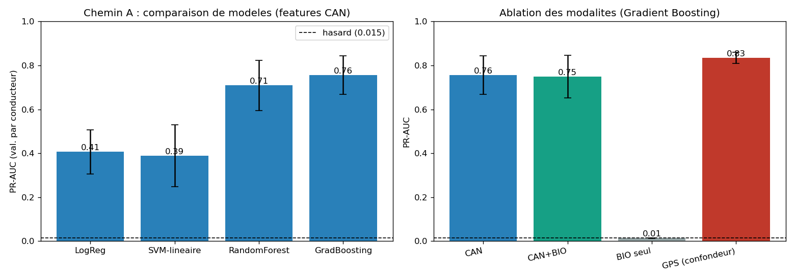

# P4 - Chemin A : apprentissage supervise

> Code : [`notebooks/03a_supervised.py`](../../notebooks/03a_supervised.py) -
> Resultats : [`docs/03_evaluation/results_supervised.json`](../03_evaluation/results_supervised.json)

## Protocole

- **Tache** : classer chaque fenetre de 1 s `normal` / `attaque` (cyberattack_active).
- **Features** : les 337 signaux CAN (honnetes ; GPS exclu, cf. [features.md](../01_projet/features.md)).
- **Validation** : **GroupKFold par conducteur** (4 folds) - un conducteur n'est jamais a la fois
  en train et en test.
- **Metrique** : **PR-AUC** (attaque rare a 1,46 % ; hasard ~ 0,015). NaN geres par HistGB ou
  imputes (mediane) dans le pipeline ; classes equilibrees (`class_weight`).

## Comparaison des modeles

| Modele | PR-AUC (val. par conducteur) |
|---|---|
| Regression logistique | 0,407 +/- 0,100 |
| SVM lineaire | 0,390 +/- 0,141 |
| Random Forest | 0,709 +/- 0,114 |
| **Gradient Boosting** | **0,756 +/- 0,088** |

## Ablation des modalites (champion Gradient Boosting)

| Modalite | PR-AUC | Lecture |
|---|---|---|
| **CAN** | **0,756** | la base honnete |
| CAN + biometrie | 0,749 | la biometrie n'aide pas (dans le bruit) |
| Biometrie seule | **0,014** | = hasard -> aucun pouvoir predictif |
| GPS (confondeur) | 0,835 | toujours le plus haut, mais spurieux (lieu) |

## Trois enseignements

### 1. Les ensembles d'arbres dominent (signature non lineaire)
Les modeles lineaires plafonnent a ~0,40 ; Random Forest (0,71) et surtout Gradient Boosting
(0,756) font bien mieux. **L'attaque laisse une signature non lineaire dans les signaux CAN** -
qu'une frontiere lineaire ne capte pas. Champion : **Gradient Boosting / CAN, PR-AUC 0,756**.

### 2. La biometrie n'aide pas a detecter l'attaque (resultat honnete)
Bien que le rythme cardiaque monte pendant l'attaque (EDA), la biometrie **seule** a une PR-AUC de
**0,014** (= hasard), et l'ajouter au CAN ne change rien (0,749 vs 0,756). La reponse physiologique
est **reelle mais trop faible et trop bruitee** pour servir de detecteur. On le dit clairement
plutot que de sur-vendre un signal multimodal.

### 3. Le confondeur GPS, confirme a grande echelle
Meme en validation par conducteur, le GPS (0,835) bat le CAN (0,756) : un modele naif **prefererait
le lieu**. C'est exactement le piege qu'on a choisi d'eviter en excluant le GPS.

## Limite a garder pour P5

La **variance entre folds est elevee** (+/- 0,09) : la performance depend des conducteurs du test.
La generalisation a de **nouveaux conducteurs** est donc incertaine - a quantifier en P5 (courbe PR,
analyse par fold, eventuellement leave-one-driver-out).

-> Etape suivante : **P4 - Chemin B (detection d'anomalie)**, qui n'utilise pas les labels et
convient a une attaque rare.
