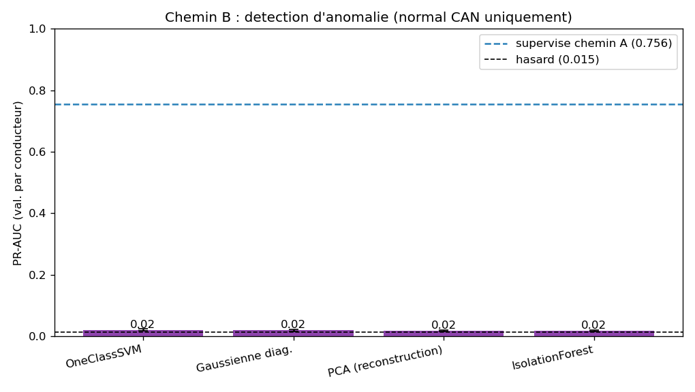

# P4 - Chemin B : detection d'anomalie

> Code : [`notebooks/03b_anomaly.py`](../../notebooks/03b_anomaly.py) -
> Resultats : [`docs/03_evaluation/results_anomaly.json`](../03_evaluation/results_anomaly.json)

## Pourquoi ce chemin

Un IDS realiste ne connait pas l'attaque a l'avance. On teste donc l'approche
**sans labels** : apprendre le profil du trafic **normal** et signaler tout ce qui
s'en ecarte. C'est l'approche « classique » pour une attaque **rare et inconnue**.

## Protocole

- **Features** : les 337 signaux CAN (GPS exclu = confondeur lieu).
- **Entrainement** : sur les fenetres **NORMALES uniquement** des conducteurs de
  train (novelty detection / semi-supervise) - les labels d'attaque ne servent
  qu'a l'evaluation.
- **Validation** : **GroupKFold par conducteur** (4 folds), comme le chemin A.
- **Pretraitement** : imputation mediane + standardisation **ajustees sur le
  normal de train** (anti-fuite). Score = degre d'anomalie (haut = suspect).
- **Metrique** : **PR-AUC** (hasard ~ 0,015).

Quatre detecteurs : Isolation Forest, One-Class SVM (RBF), PCA (erreur de
reconstruction), Gaussienne diagonale (somme des z²).

## Resultats

| Detecteur | PR-AUC (val. par conducteur) |
|---|---|
| One-Class SVM | 0,021 +/- 0,003 |
| Gaussienne diagonale | 0,020 +/- 0,003 |
| PCA (reconstruction) | 0,019 +/- 0,002 |
| Isolation Forest | 0,018 +/- 0,003 |
| *(rappel) supervise chemin A* | *0,756* |
| *(rappel) hasard* | *0,015* |

## Verdict : echec assume de l'approche non supervisee

**Les quatre detecteurs sont au niveau du hasard** (~0,02 contre 0,015). En clair :
trier les fenetres par « etrangete » ne remonte **pas** l'attaque - on aurait
autant de vrais positifs en tirant au sort. L'ecart avec le supervise (0,756) est
massif.

## Pourquoi ca echoue (l'enseignement)

1. **La variabilite entre conducteurs noie le signal.** En split par conducteur,
   le « normal » d'un conducteur de test est deja une nouveaute par rapport au
   train (style de conduite, route, vehicule). Le detecteur passe son budget
   d'anomalie sur cette derive inter-conducteur, bien plus grosse que l'attaque.
2. **L'attaque n'est pas un outlier global.** Elle ne se traduit pas par des
   valeurs CAN extremes mais par une **combinaison conditionnelle** de signaux -
   que seul un modele entraine *avec les labels* (chemin A) sait isoler.
3. **Rare ne veut pas dire aberrant.** 1,46 % d'attaque, mais ces fenetres
   ressemblent a du trafic plausible : elles n'ont rien d'aberrant au sens
   statistique. La rarete n'implique pas la detectabilite non supervisee.

C'est un **resultat negatif franc et utile** : il justifie a posteriori l'approche
supervisee et evite de vendre un detecteur d'anomalie qui « ferait illusion ».

## Consequence pour la suite

L'approche non supervisee est ecartee comme detecteur principal (a garder
eventuellement comme garde-fou de second rang). On reste sur le **supervise**.
-> Etape suivante : **P4 - Chemin C (deep)** pour voir si un reseau bat les arbres
boostes, puis **P5** (evaluation fine, courbes PR, generalisation par conducteur).
