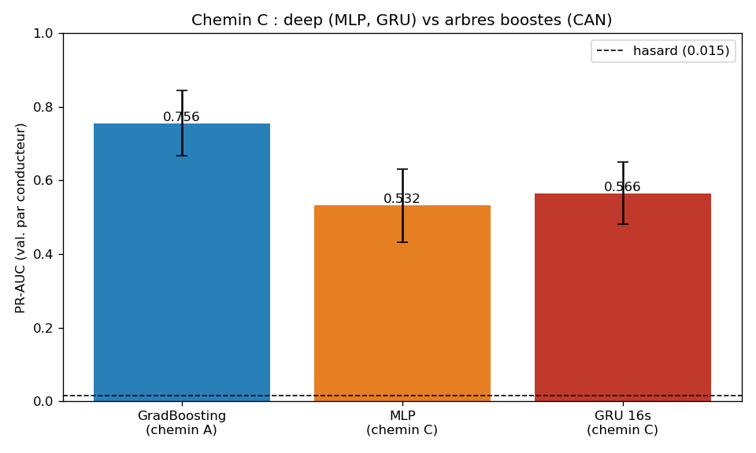

# P4 - Chemin C : apprentissage profond (deep)

> Code : [`notebooks/03c_deep_mlp.py`](../../notebooks/03c_deep_mlp.py) (MLP) &
> [`notebooks/03d_deep_gru.py`](../../notebooks/03d_deep_gru.py) (GRU) -
> Resultats : [`docs/03_evaluation/results_deep.json`](../03_evaluation/results_deep.json)

## Question

Un reseau de neurones bat-il les arbres boostes (chemin A, PR-AUC **0,756**) ?
Deux angles :
1. **MLP tabulaire** : meme vue que les arbres (une seconde = un vecteur de 337 CAN).
2. **GRU temporel** : une fenetre glissante de **16 s consecutives** par conducteur,
   pour capter la *dynamique* de l'attaque - un angle interdit aux arbres et au MLP,
   qui voient chaque seconde isolement.

Memes garde-fous : CAN seul (GPS exclu), **GroupKFold par conducteur**, PR-AUC,
imputation/standardisation ajustees sur le train, desequilibre gere (`pos_weight`).
Sequences construites **par conducteur** (ordre `interval_1s`), jamais a cheval.

## Resultats

| Modele | PR-AUC (val. par conducteur) |
|---|---|
| **Gradient Boosting (arbres, chemin A)** | **0,756 +/- 0,088** |
| GRU temporel 16 s (chemin C) | 0,566 +/- 0,084 |
| MLP tabulaire (chemin C) | 0,532 +/- 0,100 |
| *(rappel) hasard* | *0,015* |

## Verdict : le deep ne bat pas les arbres (resultat assume)

Les deux reseaux restent **nettement sous le Gradient Boosting** (0,57 et 0,53 contre
0,756). Conclusion conforme a l'etat de l'art sur le **tabulaire** : sur des features
deja agregees et heterogenes, les **arbres boostes dominent** - ils captent une
signature non lineaire par seuillage que les reseaux denses peinent a retrouver avec
si peu de positifs.

## Trois enseignements

### 1. Le contexte temporel aide un peu... mais pas assez
Le GRU (0,566) bat le MLP (0,532) : voir **16 s de dynamique** apporte un signal reel
que la vue par seconde n'a pas. Mais le gain est modeste et **n'efface pas l'ecart**
avec les arbres. Le coeur du signal est dans la signature CAN *instantanee*, pas
(surtout) dans sa dynamique.

### 2. Pourquoi les reseaux perdent ici
- **Peu de positifs** : ~1 700 fenetres d'attaque a l'entrainement -> regime
  data-pauvre, defavorable aux reseaux (gourmands), favorable aux arbres.
- **Forte variabilite inter-conducteur** : fold 1 s'effondre (MLP 0,371 / GRU 0,424),
  comme pour les arbres -> la generalisation a de nouveaux conducteurs reste le vrai
  point dur (a quantifier en P5).
- Features deja **tabulaires/agregees** : peu de structure spatiale/locale a exploiter
  par un reseau.

### 3. Le confondeur temps, surveille
Un modele temporel pourrait apprendre la **position dans le trajet** (la ou l'attaque
survient). On avait deja montre (P2/P3) que `CAN_STABLE` (signaux time-drift exclus)
egale `CAN` : le signal CAN n'est donc pas porte par ce confondeur. Le GRU n'« explose »
pas non plus son score - coherent avec un signal genuine, non un geofencing temporel.

## Conclusion de P4

Sur les trois chemins, le classement est net :

| Chemin | Meilleur PR-AUC | Verdict |
|---|---|---|
| **A - Supervise (arbres)** | **0,756** | **champion** |
| C - Deep (GRU / MLP) | 0,566 / 0,532 | sous les arbres |
| B - Anomalie (non supervise) | ~0,02 | echec (= hasard) |

**Champion retenu : Gradient Boosting sur CAN (PR-AUC 0,756).** -> Etape suivante :
**P5** (evaluation fine du champion : courbes PR, choix du seuil, generalisation par
conducteur / leave-one-driver-out pour expliquer la variance +/-0,09, importance des
signaux CAN).
