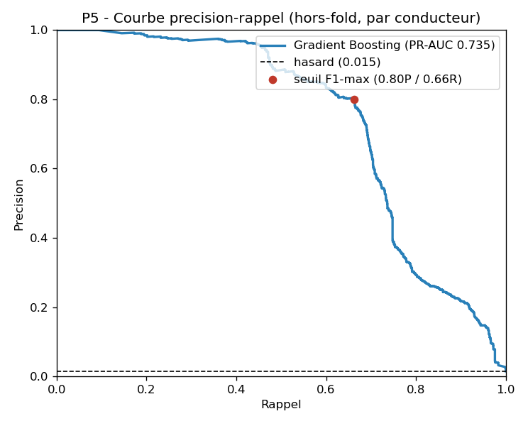
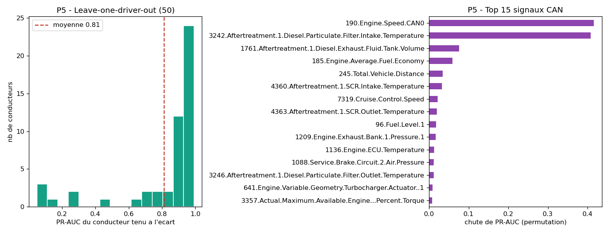

# P5 - Evaluation fine du champion (Gradient Boosting / CAN)

> Code : [`notebooks/04_evaluation.ipynb`](../../notebooks/04_evaluation.ipynb) -
> Resultats : [`docs/03_evaluation/results_evaluation.json`](../03_evaluation/results_evaluation.json)

On caracterise le **champion** de P4 (Gradient Boosting sur les 337 signaux CAN,
PR-AUC 0,756 en GroupKFold). Trois questions : *quel seuil ?*, *generalise-t-il a
de nouveaux conducteurs ?*, *sur quels signaux repose-t-il ?*

## 1. Courbe precision-rappel et seuil operationnel

Predictions **hors-fold** (chaque fenetre scoree par un modele qui n'a pas vu son
conducteur). PR-AUC global = **0,735**.

| Point de fonctionnement | Seuil | Precision | Rappel | % fenetres alertees |
|---|---|---|---|---|
| **F1-max** | 0,855 | **0,80** | 0,66 | ~1 % |
| Haute precision (rappel 0,5) | 0,977 | **0,885** | 0,50 | 0,8 % |
| Rappel 0,7 | 0,677 | 0,65 | 0,70 | 1,6 % |
| Rappel 0,8 | 0,190 | 0,29 | 0,80 | 4,0 % |
| Rappel 0,9 | 0,024 | 0,22 | 0,90 | 6,0 % |

**Lecture operationnelle.** Le modele est tres bon en **haute precision/bas rappel**
(rappel 0,5 -> 88,5 % des alertes sont justes, < 1 % du trafic alerte) mais se
degrade vite si on veut tout attraper (rappel 0,9 -> precision 0,22, alarme fatigue).
Pour un IDS deployable, on choisirait le **point haute precision** : on rate la moitie
des *secondes* d'attaque, mais comme l'attaque est un **bloc continu** de dizaines de
secondes, en attraper la moitie suffit a **detecter l'episode** sans noyer l'operateur.

## 2. Generalisation par conducteur (leave-one-driver-out)

50 modeles, chacun entraine sur 49 conducteurs et teste sur le 50e.

- PR-AUC LODO : **moyenne 0,813 +/- 0,270**, **mediane 0,920**, min 0,049, max 0,993.
- **38/50 conducteurs >= 0,80** ; mais **7 conducteurs < 0,50**, dont **6 du Groupe 1**
  (1_S4 = 0,05 ; 1_S11 = 0,08 ; 1_S12 = 0,10 ; 1_S7 = 0,12 ...).

**C'est l'enseignement central de P5.** La distribution est **bimodale** : excellente
pour la grande majorite (mediane 0,92), mais elle **s'effondre sur une minorite,
concentree dans le Groupe 1**. La variance inter-folds de P4 (+/-0,09) n'etait donc pas
du bruit : elle reflete **quels conducteurs difficiles tombent dans le fold de test**.
La signature d'attaque apprise sur les autres **ne transfere pas** a ces conducteurs -
piste a creuser (Groupe 1 = niveau d'awareness / conditions differentes ?). Honnetement :
l'IDS est fiable pour la plupart des conducteurs, **pas pour tous**.

## 3. Sur quels signaux repose la detection ?

Permutation importance (chute de PR-AUC quand on permute le signal), holdout 12 conducteurs.

| Signal CAN (SPN J1939) | Chute de PR-AUC |
|---|---|
| **190 - Engine Speed (regime moteur)** | **+0,42** |
| **3242 - DPF Intake Temperature** | **+0,41** |
| 1761 - DEF Tank Volume | +0,08 |
| 185 - Average Fuel Economy | +0,06 |
| 245 - Total Vehicle Distance | +0,03 |
| ... (longue traine) | < 0,03 |

**Deux signaux portent presque toute la detection.**
- **190 Engine Speed** : attention, **ce N'EST PAS le spoof**. La vérification du dataset
  (cf. [verification_dataset.md](../04_conclusion/verification_dataset.md)) montre que le
  régime moteur **n'est jamais mis a zero** pendant l'attaque dans nos features (0 % de
  valeurs ~0 ; l'attaque ne zerote que l'**affichage**, pas la diffusion ECU loggee).
  Le SPN 190 capte donc le **comportement du conducteur et le contexte routier** de la
  fenetre d'attaque (regime pendant la reaction / au lieu fixe), **pas l'injection CAN**.
  -> cohérent avec P5+ : on détecte la réaction, pas l'injection.
- **3242 DPF Intake Temperature** est une **temperature d'echappement a derive lente**
  -> suspect de **confondeur temps** (elle monte avec le roulage, correle au moment de
  l'attaque). Garde-fou deja pose en P2/P3 : exclure les 21 signaux time-drift
  (`CAN_STABLE`) ne change rien (0,630 vs 0,632) -> le modele **ne depend pas** de cette
  temperature. On la signale donc comme **aide redondante et potentiellement confondue**,
  pas comme preuve.

## Bilan P5

- **Champion confirme** : Gradient Boosting / CAN, PR-AUC 0,74-0,76 (hors-fold / GroupKFold),
  0,81 en LODO. Seuil recommande : **haute precision** (P 0,88 / R 0,50, < 1 % d'alertes).
- **Limite assumee** : generalisation **bimodale** - excellente sauf pour ~6 conducteurs
  du Groupe 1. C'est la vraie fragilite, pas le score moyen.
- **Ce que detecte le modele** : le **comportement/contexte** de la fenetre d'attaque
  (regime moteur 190) - **pas l'injection** (le spoof tach->0 est absent des features
  agregees, cf. [verification_dataset.md](../04_conclusion/verification_dataset.md)). La
  temperature DPF (3242) est une aide redondante a surveiller (confondeur temps possible).

-> Suite : robustesse / cote "intelligent" de l'IDS, puis livrables (demo, rapport .docx,
slides .pptx) en reutilisant les generateurs de l'ancien projet.
