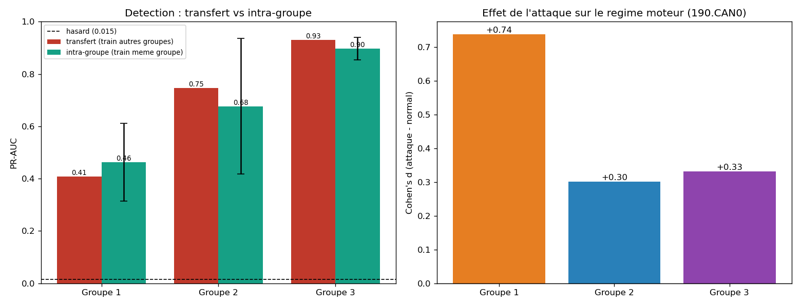

# P5+ - Pourquoi l'IDS echoue sur le Groupe 1 (et robustesse)

> Code : [`notebooks/05_group_analysis.py`](../../notebooks/05_group_analysis.py) -
> Resultats : [`docs/03_evaluation/results_group_analysis.json`](../03_evaluation/results_group_analysis.json)

En P5, le leave-one-driver-out s'effondrait sur ~6 conducteurs, **tous du Groupe 1**.
On elucide pourquoi. Rappel des groupes (README) - niveau d'**awareness** croissant :

| Groupe | Consigne donnee au conducteur |
|---|---|
| **1** (N=17) | **aucune** connaissance prealable de l'attaque |
| **2** (N=16) | prevenu qu'une attaque **peut** survenir |
| **3** (N=17) | prevenu **+ consigne de se garer** si ca arrive |

L'attaque met le tachymetre/compteur a **zero** et **s'arrete apres 1 min OU si le
conducteur se gare**.

## 1. La detectabilite suit le niveau d'awareness

PR-AUC leave-one-driver-out (P5) agrege par groupe :

| Groupe | Mediane | Moyenne | Conducteurs < 0,50 |
|---|---|---|---|
| **1** | 0,740 | 0,606 | **6 / 17** |
| **2** | 0,923 | 0,888 | 1 / 16 |
| **3** | 0,960 | 0,949 | 0 / 17 |

Gradient **monotone** : plus le conducteur est informe, mieux l'attaque se detecte.

## 2. L'attaque du Groupe 1 ne transfere pas... et est dure en soi

| Test | **Transfert** (train sur les 2 autres groupes) | **Intra-groupe** (train+test meme groupe) |
|---|---|---|
| Groupe 1 | **0,409** | **0,462 +/- 0,148** |
| Groupe 2 | 0,747 | 0,677 +/- 0,260 |
| Groupe 3 | 0,930 | 0,898 +/- 0,043 |

Lecture cle : pour le Groupe 1, **meme entraine uniquement sur le Groupe 1**, le modele
plafonne a **0,46**. Ce n'est donc **pas** un simple defaut de transfert (signature que
les autres n'auraient pas apprise) : **l'attaque du Groupe 1 est intrinsequement plus
difficile a detecter**. A l'inverse, le Groupe 3 est facile (0,90) ET transferable (0,93).

> **Caveat qualite de donnees (verification dataset).** Le pire conducteur, **G1S04**
> (LODO 0,05), a un **CAN collecte a basse frequence** (erreur documentee dans le README).
> Son effondrement est donc **en partie un artefact de donnees**, pas seulement
> d'awareness. Mais le gradient **survit sans lui** : Groupe 1 sans G1S04 = mediane
> **0,750** (moy 0,641 ; **5/16** conducteurs < 0,5) vs Groupe 2 0,92 / Groupe 3 0,96.
> La conclusion tient. Cf. [verification_dataset.md](../04_conclusion/verification_dataset.md).

## 3. Le mecanisme : on detecte surtout la REACTION du conducteur

Signature du regime moteur (SPN 190) pendant l'attaque vs normal, par groupe :

| Groupe | `mean.190.Engine.Speed` (bus principal) | Comportement |
|---|---|---|
| 3 | **d = -0,48** (le regime CHUTE) | ils **se garent** -> signature nette, reproductible |
| 2 | d = +0,03 (quasi nul) | reaction intermediaire |
| 1 | d = +0,13 (quasi nul) | **pas de reaction distinctive** (ils ignorent l'attaque) |

Duree moyenne d'attaque par conducteur : **56 s (G1) -> 47 s (G2) -> 33 s (G3)** -
coherent avec « l'attaque s'arrete si on se gare » : le Groupe 3 ecourte l'attaque en
se garant, ce qui imprime une signature comportementale forte (deceleration, arret).

**Synthese honnete.** Le detecteur capte en grande partie **la reponse humaine a
l'attaque**, pas seulement l'injection CAN malveillante :
- Groupe 3 : reaction franche et uniforme (se garer -> le regime tombe) -> signal propre,
  independant du conducteur -> detection 0,90, transfert 0,93.
- Groupe 1 : aucune reaction -> le seul « signal » est ce que produit le spoof dans le
  contexte routier (au lieu fixe de l'attaque), faible et **incoherent d'un conducteur a
  l'autre** -> detection 0,46, transfert 0,41.

## 4. La consequence qui derange (et qu'on assume)

L'IDS est **le plus faible sur le conducteur NON averti** - c'est-a-dire **exactement le
cas ou un IDS serait le plus utile** (l'attaque que l'humain ne remarque pas). Une partie
de notre « detection d'intrusion » est en realite de la **detection de reaction du
conducteur**, qui est une forme deguisee de confondeur comportemental. C'est la limite
fondamentale a poser noir sur blanc : sur l'injection CAN *pure*, independante de
l'humain, la detectabilite reelle est plus proche du **0,46** intra-Groupe-1 que du 0,76
moyen.

## 5. Robustesse sous bruit (sanity check)

Champion sur un split conducteur (baseline holdout 0,632), bruit gaussien ajoute au test :

| Bruit (% de sigma) | 0 | 5 | 10 | 25 | 50 |
|---|---|---|---|---|---|
| PR-AUC | 0,632 | 0,614 | 0,593 | 0,562 | 0,493 |

Degradation **graduelle**, sans effondrement : le modele ne repose pas sur quelques
valeurs fragiles. -22 % relatif a 50 % de sigma (bruit massif). Robustesse acceptable.

## Pistes ouvertes

- Construire une cible « injection pure » (independante de la reaction) serait l'ideal,
  mais le dataset ne separe pas les deux -> limite du jeu de donnees, a documenter.
- Pour un IDS deployable, viser des signaux d'injection *cote bus* (incoherences
  inter-bus du SPN 190 : `190.Engine.Speed` vs `190.Engine.Speed.CAN0`) plutot que la
  reaction du conducteur - piste pour une suite.

-> Suite : livrables (demo de detection, rapport .docx, slides .pptx) en reutilisant les
generateurs de l'ancien projet.
